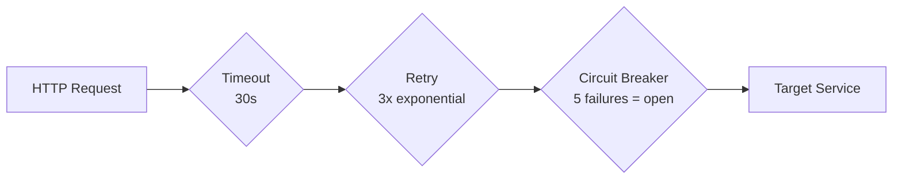

# HTTP Communication Infrastructure Walkthrough

## Summary

Implemented high-performance inter-service HTTP communication using `IHttpClientFactory` with Polly resiliency policies.

## What Was Created

### BuildingBlocks/ServiceClients/

| File | Purpose |
|------|---------|
| `ServiceClientConfiguration.cs` | Configuration for service URLs & resiliency settings |
| `PollyPolicies.cs` | Retry, Circuit Breaker, Timeout policies |
| `IServiceClients.cs` | Interfaces for each service client |
| `ServiceClientImplementations.cs` | HTTP client implementations |
| `HttpClientServiceExtensions.cs` | DI registration extension method |
| `Dtos.cs` | Shared DTOs for responses |

---

## Resiliency Features



- **Retry Policy**: 3 retries with exponential backoff (2s, 4s, 8s)
- **Circuit Breaker**: Opens after 5 consecutive failures, stays open 30s
- **Timeout**: 30s per request

---

## Integration Examples

### Ordering Service → Catalog Service
In `CreateOrderHandler`, products are validated and prices fetched from Catalog Service:

```csharp
var productsResponse = await _catalogClient.GetProductsByIdsAsync(productIds, cancellationToken);
if (!productsResponse.IsSuccess)
{
    return EndpointResponse<CreateOrderDto>.ErrorResponse(
        $"Failed to validate products: {productsResponse.ErrorMessage}", 
        productsResponse.StatusCode);
}
```

### Delivery Service → Ordering Service
In `CreateShipmentHandler`, orders are validated before creating shipments:

```csharp
var orderResponse = await _orderingClient.GetOrderByIdAsync(request.OrderId, cancellationToken);
if (!orderResponse.IsSuccess)
{
    return EndpointResponse<ShipmentDto>.ErrorResponse(
        $"Order not found: {orderResponse.ErrorMessage}", 
        orderResponse.StatusCode);
}
```

---

## Configuration

### appsettings.json
```json
"ServiceClients": {
  "CatalogServiceUrl": "http://localhost:5001",
  "CartServiceUrl": "http://localhost:5002",
  "OrderingServiceUrl": "http://localhost:5003",
  "DeliveryServiceUrl": "http://localhost:5004",
  "TimeoutSeconds": 30,
  "RetryCount": 3,
  "CircuitBreakerExceptionsBeforeBreaking": 5,
  "CircuitBreakerDurationSeconds": 30
}
```

### Program.cs
```csharp
using BuildingBlocks.ServiceClients;

builder.Services.AddServiceClients(builder.Configuration);
```

---

## Build Verification

✅ **Build succeeded** with 0 errors

