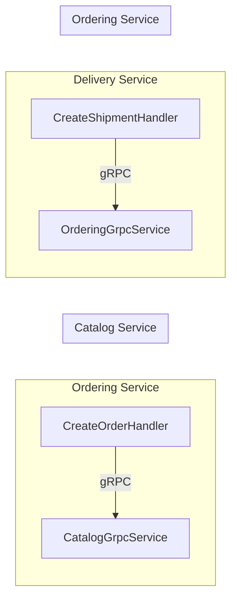

# gRPC Communication Infrastructure Walkthrough

## Summary

Replaced HTTP-based inter-service communication with **gRPC** for ~10x faster binary protocol performance.

## Architecture



---

## What Was Created

### Proto Files (`BuildingBlocks/Protos/`)

| File | Purpose |
|------|---------|
| `catalog.proto` | Product queries (GetProduct, GetProductsByIds) |
| `ordering.proto` | Order queries (GetOrderById, GetUserOrders) |

---

### gRPC Servers

| Service | File | Exposes |
|---------|------|---------|
| Catalog Service | `GrpcServices/CatalogGrpcService.cs` | Product data |
| Ordering Service | `GrpcServices/OrderingGrpcService.cs` | Order data |

---

### gRPC Clients

| Service | Calls | Used In |
|---------|-------|---------|
| Ordering Service | `CatalogGrpc.CatalogGrpcClient` | `CreateOrderHandler` |
| Delivery Service | `OrderingGrpc.OrderingGrpcClient` | `CreateShipmentHandler` |

---

## Configuration

### appsettings.json
```json
"GrpcServices": {
  "CatalogServiceUrl": "https://localhost:5001",
  "OrderingServiceUrl": "https://localhost:5003"
}
```

---

## gRPC vs HTTP Performance

| Aspect | HTTP/JSON | gRPC |
|--------|-----------|------|
| Serialization | JSON (text) | Protobuf (binary) |
| Speed | Slower | **~10x faster** |
| Payload size | Larger | **~50% smaller** |
| Streaming | Limited | Full support |
| Connection | Per-request | Multiplexed |

---

## Build Verification

✅ **Build succeeded** with 0 errors
